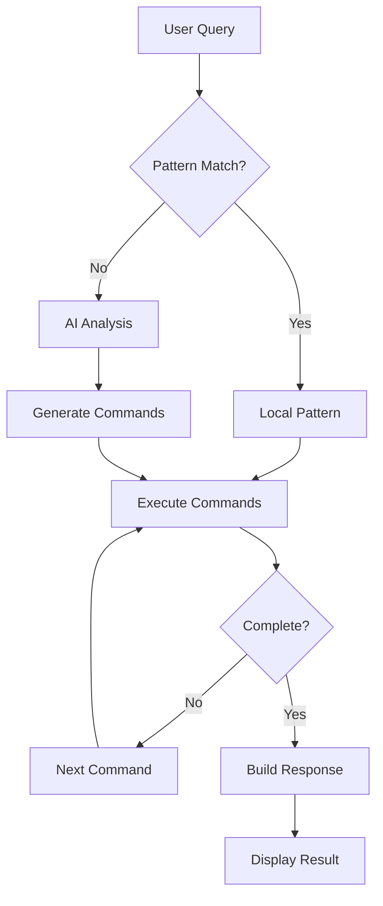

# MCP Terminal Assistant - ipcom-chat

<div align="center">

**Assistente AI inteligente para o terminal Linux/Mac**

[](https://opensource.org/licenses/MIT)


</div>

## Resolva erros, execute comandos complexos, aprenda com seu uso

MCP Terminal Assistant transforma seu terminal em um assistente inteligente que entende contexto, executa múltiplos comandos automaticamente e aprende com seu uso diário. Não mais pesquisas no Google - tenha respostas precisas direto no terminal.

**Interface principal:** `ipcom-chat` - uma experiência rica e interativa no terminal com histórico persistente, markdown rendering e execução iterativa de comandos.

## 🚀 Quick Start - 3 Comandos

```bash
# 1. Instalar (uma linha, automático)
curl -sSL https://raw.githubusercontent.com/fabiotheo/mcp-devops/master/scripts/install.sh | bash

# 2. Configurar API key (interativo)
ipcom-chat --setup

# 3. Usar imediatamente
ipcom-chat "como ver portas abertas?"
```

### Exemplo Real: Resolvendo Erro de Permissão

```bash
$ docker ps
Cannot connect to the Docker daemon. Is the docker daemon running?

$ ipcom-chat
🔍 Analisando erro do Docker...
✓ Detectado: Docker daemon não está rodando

📝 Executando diagnóstico:
  1. Verificando status do serviço... [systemctl status docker]
  2. Verificando permissões do usuário... [groups]

🛠️ Solução encontrada:
sudo systemctl start docker
sudo usermod -aG docker $USER

💡 Deseja executar os comandos? [Y/n]
```

### Interface Interativa com Ink

<div align="center">

```
┌─────────────────────────────────────────────────────────┐
│ ipcom-chat v2.0.0 - Terminal Assistant                 │
├─────────────────────────────────────────────────────────┤
│ 👤 User: fabio | 📝 History: 42 messages | 🤖 Claude  │
├─────────────────────────────────────────────────────────┤
│                                                         │
│ You: como verificar quais portas estão abertas?        │
│                                                         │
│ Assistant: Vou mostrar várias formas de verificar      │
│ portas abertas no seu sistema:                         │
│                                                         │
│ 1. **Usando netstat** (tradicional):                   │
│    ```bash                                             │
│    sudo netstat -tulpn                                 │
│    ```                                                 │
│                                                         │
│ 2. **Usando ss** (moderno, mais rápido):              │
│    ```bash                                             │
│    sudo ss -tulpn                                      │
│    ```                                                 │
│                                                         │
│ 3. **Usando lsof** (detalhado):                       │
│    ```bash                                             │
│    sudo lsof -i -P -n | grep LISTEN                   │
│    ```                                                 │
│                                                         │
│ 💡 Executar comando 2 agora? [Y/n]                    │
└─────────────────────────────────────────────────────────┘
 [Ctrl+C] Cancelar | [↑↓] Histórico | [Tab] Completar
```

</div>

## ✨ Features Principais

### 🔍 1. Análise Inteligente de Erros

**Captura automática → Diagnóstico → Solução executável**

```bash
# ERRO REAL
$ git push origin main
error: failed to push some refs to 'github.com:user/repo.git'
hint: Updates were rejected because the remote contains work...

# SOLUÇÃO COM ipcom-chat
$ ipcom-chat
📊 Analisando conflito no Git...

Executando diagnóstico:
  git status → modified: README.md
  git fetch origin → 2 commits ahead
  git diff origin/main → conflicts detected

✅ Solução (3 opções):
1. git pull --rebase origin main  [Recomendado]
2. git pull origin main            [Merge commit]
3. git push --force                [⚠️ Sobrescrever]

Escolha [1-3]: _
```

### 🔄 2. Sistema Iterativo de Refinamento

**Perguntas complexas → Múltiplos comandos → Resposta completa**

```bash
$ ipcom-chat "quantos IPs estão bloqueados no fail2ban?"

🔄 Executando análise iterativa...

[1/4] fail2ban-client status
      → Jails ativos: sshd, apache, nginx

[2/4] fail2ban-client status sshd
      → 3 IPs bloqueados: 192.168.1.10, 10.0.0.5, 172.16.0.2

[3/4] fail2ban-client status apache
      → 2 IPs bloqueados: 203.0.113.0, 198.51.100.0

[4/4] fail2ban-client status nginx
      → 1 IP bloqueado: 192.0.2.0

📊 Resumo Final:
• Total: 6 IPs bloqueados
• sshd: 3 IPs (50%)
• apache: 2 IPs (33%)
• nginx: 1 IP (17%)
```

### 🎨 3. Interface Ink Interativa

**UI rica no terminal com React + MCP Protocol**

#### Features da Interface:
- ✅ **Histórico Persistente**: Conversas salvas por usuário em SQLite
- ✅ **Syntax Highlighting**: Colorização inteligente de código
- ✅ **Markdown Rendering**: Formatação rica com negrito, itálico, listas
- ✅ **Execução Inline**: Execute comandos direto da interface
- ✅ **Multi-usuário**: Cada usuário tem seu próprio contexto
- ✅ **Atalhos**: `Ctrl+C` cancelar, `↑↓` histórico, `Tab` autocompletar

```bash
# Modo interativo
$ ipcom-chat
# Abre interface Ink com histórico completo

# Pergunta direta
$ ipcom-chat "como criar backup incremental?"
# Resposta imediata com comandos prontos

# Pipeline com outros comandos
$ cat error.log | ipcom-chat analyze
# Analisa conteúdo e sugere soluções
```

### 🤖 4. Multi-AI Provider Support

**Escolha o melhor modelo para cada situação**

| Provider | Modelo | Contexto | Velocidade | Custo | Melhor Para |
|----------|--------|----------|------------|-------|-------------|
| **Claude** | Sonnet 3.5 | 200K tokens | ⚡⚡⚡ | $$ | Código complexo, análise profunda |
| **GPT-4** | Turbo | 128K tokens | ⚡⚡ | $$$ | Conhecimento geral, criatividade |
| **Gemini** | Pro 1.5 | 2M tokens | ⚡⚡⚡⚡ | $ | Documentos grandes, análise rápida |

```bash
# Configurar provider padrão
ipcom-chat config set default_provider claude

# Usar provider específico
ipcom-chat --provider gemini "analyze this log file"

# Ver status dos providers
ipcom-chat --provider-status
```

### 🌐 5. Web Search Integrado

**Busca inteligente com cache e priorização**

```bash
$ ipcom-chat "como configurar nginx com ssl lets encrypt ubuntu 24?"

🔍 Buscando informações atualizadas...
  ✓ Documentação oficial nginx
  ✓ Certbot para Ubuntu 24.04
  ✓ Stack Overflow (3 soluções recentes)

📚 Fontes consultadas:
  • nginx.org/en/docs/http/configuring_https_servers.html
  • certbot.eff.org/instructions?ws=nginx&os=ubuntu-24
  • github.com/certbot/certbot/issues/recent

💾 Cache: Resultado salvo por 7 dias
```

Configurações de cache inteligente:
- **Documentação**: 7 dias
- **Soluções de erro**: 24 horas
- **Info de pacotes**: 1 hora
- **Man pages**: 30 dias

### ⚡ 6. Pattern Matching Local

**Respostas instantâneas sem usar API**

```bash
# Base de padrões local para erros comuns
~/.mcp-terminal/patterns/
├── git_errors.json      # 150+ padrões Git
├── npm_errors.json      # 100+ erros NPM/Node
├── docker_errors.json   # 80+ problemas Docker
├── linux_errors.json    # 200+ erros sistema
└── custom_patterns.json # Seus padrões personalizados
```

Exemplo de resposta instantânea:
```bash
$ npm install
ERROR: EACCES: permission denied

$ ipcom-chat
⚡ Solução local (sem API):
npm cache clean --force
sudo npm install -g --unsafe-perm

# Resposta em <100ms
```

## 🏗️ Arquitetura V2

### Visão Geral do Sistema

```
┌──────────────────────────────────────────────────────┐
│              MCP Terminal Assistant V2                │
├──────────────────────────────────────────────────────┤
│                                                       │
│  User Input (ipcom-chat)                            │
│      ↓                                               │
│  ┌─────────────────────────────────┐                │
│  │   Interface Ink (React + MCP)   │                │
│  │  • Rich UI Components           │                │
│  │  • Markdown Rendering           │                │
│  │  • Command Execution            │                │
│  └─────────────────────────────────┘                │
│      ↓                                               │
│  ┌─────────────────────────────────┐                │
│  │    MCP Protocol Server          │                │
│  │  • Message Handling             │                │
│  │  • Tool Management              │                │
│  │  • Session Control              │                │
│  └─────────────────────────────────┘                │
│      ↓                                               │
│  ┌─────────────────────────────────┐                │
│  │   Pipeline de Processamento     │                │
│  │                                 │                │
│  │  1. Pattern Matcher            │                │
│  │     ↓                          │                │
│  │  2. Command Executor           │                │
│  │     ↓                          │                │
│  │  3. AI Orchestrator            │                │
│  │     ↓                          │                │
│  │  4. Response Builder           │                │
│  └─────────────────────────────────┘                │
│      ↓                                               │
│  ┌─────────────────────────────────┐                │
│  │     Camada de Persistência      │                │
│  │  • SQLite (Histórico)          │                │
│  │  • Cache (Responses)           │                │
│  │  • Config (Settings)           │                │
│  └─────────────────────────────────┘                │
│                                                       │
└──────────────────────────────────────────────────────┘
```

### Componentes Principais

#### 1. **ipcom-chat** - Interface Principal
- Interface Ink baseada em React para terminal
- Suporte a Markdown e syntax highlighting
- Histórico persistente por usuário
- Execução de comandos inline

#### 2. **MCP Protocol** - Comunicação
- Model Context Protocol para comunicação estruturada
- Gerenciamento de ferramentas e capacidades
- Streaming de respostas em tempo real
- Controle de sessão e contexto

#### 3. **AI Orchestrator** - Cérebro do Sistema
- Sistema iterativo de refinamento (`ai_orchestrator.js`)
- Executa múltiplos comandos até ter resposta completa
- Mantém contexto e objetivo da conversa
- Integração com múltiplos providers de AI

#### 4. **Pattern Matcher** - Respostas Rápidas
- Biblioteca local de padrões (`libs/pattern_matcher.js`)
- Detecção de comandos comuns (fail2ban, docker, disk usage)
- Execução pré-definida de sequências
- Extração inteligente de dados

#### 5. **Persistência** - Dados do Usuário
- **SQLite**: Histórico de conversas, contexto por usuário
- **Cache**: Respostas de AI, resultados de web search
- **Config**: API keys, preferências, personalizações

### Fluxo de Execução Detalhado



### Estrutura de Diretórios

```
mcp-devops/
├── src/
│   ├── mcp-ink-cli.mjs       # Interface Ink principal
│   ├── mcp-server.js          # Servidor MCP
│   └── database.js            # Gerenciamento SQLite
├── libs/
│   ├── pattern_matcher.js    # Sistema de padrões
│   └── command_executor.js   # Executor de comandos
├── ai_models/
│   ├── base_model.js         # Interface base
│   ├── claude_model.js       # Provider Claude
│   ├── openai_model.js       # Provider OpenAI
│   ├── gemini_model.js       # Provider Gemini
│   └── model_factory.js      # Factory pattern
├── patterns/
│   ├── git_errors.json       # Padrões Git
│   ├── npm_errors.json       # Padrões NPM
│   ├── docker_errors.json    # Padrões Docker
│   └── linux_errors.json     # Padrões Linux
├── web_search/
│   └── web_searcher.js       # Busca web integrada
└── setup.js                   # Instalador principal
```

## 🔧 Instalação Completa

### Requisitos do Sistema

```
┌─────────────────────────────────────┐
│        Requisitos Mínimos          │
├─────────────────────────────────────┤
│ • Sistema: Linux/Mac               │
│ • Node.js: 18.0.0 ou superior     │
│ • NPM/PNPM: Última versão         │
│ • Shell: Bash ou Zsh              │
│ • Espaço: ~100MB                  │
│ • RAM: 512MB livre                │
└─────────────────────────────────────┘
```

### Métodos de Instalação

#### 🚀 Instalação Rápida (Recomendada)

```bash
# Uma linha - instala tudo automaticamente
curl -sSL https://raw.githubusercontent.com/fabiotheo/mcp-devops/master/scripts/install.sh | bash

# Ou com wget
wget -qO- https://raw.githubusercontent.com/fabiotheo/mcp-devops/master/scripts/install.sh | bash
```

#### 🛠️ Instalação Manual

```bash
# 1. Clone o repositório
git clone https://github.com/fabiotheo/mcp-devops.git
cd mcp-devops

# 2. Instale dependências
pnpm install  # ou npm install

# 3. Execute o setup interativo
node setup.js

# 4. Configure o PATH (escolha seu shell)
# Para Zsh:
echo 'export PATH="$HOME/.mcp-terminal/bin:$PATH"' >> ~/.zshrc
source ~/.zshrc

# Para Bash:
echo 'export PATH="$HOME/.mcp-terminal/bin:$PATH"' >> ~/.bashrc
source ~/.bashrc
```

#### 🔄 Atualização

```bash
# Atualização automática preservando configurações
ipcom-chat --upgrade

# Ou manualmente
cd ~/mcp-devops
git pull origin master
pnpm install
node setup.js --upgrade --auto
```

### Configuração Inicial

#### 1. Setup Interativo (Recomendado)

```bash
ipcom-chat --setup

# O assistente irá perguntar:
# 1. Escolha do provider AI (Claude/GPT/Gemini)
# 2. API Key do provider escolhido
# 3. Configurações de cache
# 4. Integração com shell
```

#### 2. Configuração Manual

```bash
# Definir API Keys
ipcom-chat config set anthropic_api_key "sk-ant-..."
ipcom-chat config set openai_api_key "sk-..."
ipcom-chat config set gemini_api_key "..."

# Escolher provider padrão
ipcom-chat config set default_provider "claude"

# Configurar modelo
ipcom-chat config set claude_model "claude-3-sonnet-20240229"
```

### Integração com Shell

#### Para Zsh
```bash
# Adicionar ao ~/.zshrc
source ~/.mcp-terminal/shell/zsh-integration.sh

# Ativa:
# - Captura automática de erros
# - Alias 'q' para perguntas rápidas
# - Histórico integrado
```

#### Para Bash
```bash
# Adicionar ao ~/.bashrc
source ~/.mcp-terminal/shell/bash-integration.sh
```

### Verificação da Instalação

```bash
# Verificar versão
ipcom-chat --version
# Expected: ipcom-chat v2.0.0

# Testar funcionamento
ipcom-chat "hello world"

# Verificar configuração
ipcom-chat config list

# Testar providers
ipcom-chat --test-providers
```

### Troubleshooting de Instalação

| Problema | Causa | Solução |
|----------|-------|---------|
| `command not found: ipcom-chat` | PATH não configurado | `export PATH="$HOME/.mcp-terminal/bin:$PATH"` |
| `Permission denied` | Falta de permissão | `chmod +x ~/.mcp-terminal/bin/ipcom-chat` |
| `Node version too old` | Node < 18 | `nvm install 18 && nvm use 18` |
| `Cannot find module` | Deps faltando | `cd ~/.mcp-terminal && pnpm install` |
| `API key not set` | Config incompleta | `ipcom-chat --setup` |
| `EACCES npm` | Permissões npm | `npm config set prefix ~/.npm-global` |


## 💻 Comandos e Uso Avançado

### Flags e Opções Principais

```
┌─────────────────────────────────────────────┐
│ ipcom-chat [query] [options]               │
├─────────────────────────────────────────────┤
│ Opções Básicas:                             │
│   --help, -h        Mostra ajuda completa  │
│   --version, -v     Exibe versão instalada │
│   --setup           Configuração inicial   │
│   --upgrade         Atualiza para nova v.  │
│                                             │
│ Histórico:                                  │
│   --history         Exibe conversações     │
│   --clear-history   Limpa histórico        │
│   --export-history  Exporta para JSON      │
│                                             │
│ Providers AI:                               │
│   --provider NAME   Escolhe provider       │
│   --model NAME      Escolhe modelo         │
│   --test-providers  Testa conexões         │
│                                             │
│ Debug e Análise:                           │
│   --debug           Modo verbose com log   │
│   --dry-run         Simula sem executar    │
│   --explain         Explica comando        │
│                                             │
│ Formatação:                                │
│   --no-color        Remove cores           │
│   --json            Output em JSON         │
│   --quiet           Mínimo output          │
└─────────────────────────────────────────────┘
```

### Modos de Operação

#### 1. Pergunta Direta
```bash
# Pergunta simples
ipcom-chat "como matar processo na porta 8080?"

# Com contexto de arquivo
ipcom-chat "analise este erro" < error.log

# Com provider específico
ipcom-chat --provider gemini "explique docker compose"
```

#### 2. Modo Interativo
```bash
# Abre interface Ink completa
ipcom-chat

# Features do modo interativo:
# - Histórico completo com setas ↑↓
# - Tab completion para comandos
# - Syntax highlighting automático
# - Execução inline de comandos
# - Markdown rendering
```

#### 3. Pipeline e Integração
```bash
# Pipe de saída de comando
docker logs container | ipcom-chat analyze

# Análise de arquivos
cat /var/log/nginx/error.log | ipcom-chat "find security issues"

# Combinação com grep
grep ERROR app.log | ipcom-chat summarize

# Geração de scripts
ipcom-chat "backup script for postgres" > backup.sh
```

### Exemplos Categorizados

#### 📊 Análise de Logs
```bash
# Analisar últimos erros
ipcom-chat "analise os erros em /var/log/syslog"

# Encontrar padrões suspeitos
ipcom-chat "encontre tentativas de invasão no auth.log"

# Resumir logs do dia
ipcom-chat "resume os eventos importantes de hoje" < /var/log/messages

# Identificar gargalos
ipcom-chat "analyze performance issues" < app.log
```

#### 🌐 Troubleshooting de Rede
```bash
# Diagnosticar conectividade
ipcom-chat "por que não consigo acessar google.com?"

# Configurar firewall
ipcom-chat "como abrir porta 443 no ufw?"

# Análise de tráfego
ipcom-chat "explique este output do tcpdump" < capture.txt

# Debug de DNS
ipcom-chat "debug dns resolution problems"
```

#### 🐳 Gerenciamento de Containers
```bash
# Debug de containers
ipcom-chat "por que meu container está em restart loop?"

# Otimização de imagens
ipcom-chat "como reduzir tamanho da imagem node:18?"

# Docker Compose
ipcom-chat "crie um compose para wordpress com mysql"

# Kubernetes
ipcom-chat "debug este pod que não sobe" < pod-describe.yaml
```

#### 🔒 Segurança e Hardening
```bash
# Auditoria de segurança
ipcom-chat "verifique portas abertas e serviços expostos"

# SSH Hardening
ipcom-chat "melhore a segurança do meu sshd_config"

# Análise de permissões
ipcom-chat "find files with dangerous permissions"

# Firewall rules
ipcom-chat "configure iptables for web server"
```

### Integração com Scripts

```bash
#!/bin/bash
# error-handler.sh

ERROR_MSG=$("$@" 2>&1)
if [ $? -ne 0 ]; then
    SOLUTION=$(echo "$ERROR_MSG" | ipcom-chat --json)
    echo "Erro detectado. Solução sugerida:"
    echo "$SOLUTION" | jq -r '.solution'
fi
```

### Personalização Avançada

```bash
# Configurar comportamento
ipcom-chat config set system_prompt "Be concise and technical"
ipcom-chat config set temperature 0.3  # Mais determinístico

# Criar aliases úteis (adicionar ao ~/.bashrc)
alias q='ipcom-chat'  # Pergunta rápida
alias qerr='ipcom-chat analyze error'
alias qlog='ipcom-chat analyze log'
```

## ⚙️ Configuração e Personalização

### Arquivo de Configuração

Localização: `~/.mcp-terminal/config.json`

```json
{
  "version": "2.0.0",
  "user": {
    "name": "fabio",
    "shell": "zsh"
  },
  "ai": {
    "default_provider": "claude",
    "providers": {
      "claude": {
        "api_key": "sk-ant-...",
        "model": "claude-3-sonnet-20240229",
        "max_tokens": 4000,
        "temperature": 0.7
      }
    }
  },
  "features": {
    "web_search": {
      "enabled": true,
      "cache_duration_hours": 24
    },
    "pattern_matching": {
      "enabled": true
    },
    "auto_execute": false,
    "confirm_commands": true
  }
}
```

### Gerenciamento de Configuração

```bash
# Listar configurações
ipcom-chat config list

# Definir configuração
ipcom-chat config set features.auto_execute true

# Backup/Restore
ipcom-chat config backup > config.backup.json
ipcom-chat config restore < config.backup.json
```

### Modo Debug

O modo debug fornece informações detalhadas para diagnóstico:

```bash
# Ativar modo debug
ipcom-chat --user fabio --debug

# Features do modo debug:
# - Mostra [DEBUG] no header do terminal
# - Grava log detalhado em /tmp/mcp-debug.log
# - Registra respostas brutas da IA
# - Rastreia processamento de formatação
# - Útil para diagnóstico de problemas

# Ver log em tempo real (em outro terminal)
tail -f /tmp/mcp-debug.log

# Estrutura do log:
# - Resposta bruta da IA (JSON completo)
# - Texto extraído
# - Processamento de formatação (entrada/saída)
# - Linhas modificadas (listas, bold, etc)
```

**Nota:** O log só é criado quando `--debug` é usado. Em modo normal, nenhum log é gravado para máxima performance.

## 📚 Documentação Antiga (Referência)

### Command Assistance

```bash
# Ask for command help in natural language
ask "how to find files modified in the last 24 hours"

# Short form for quick questions
q "how to find and kill a process by name"
```

### Command Monitoring

MCP Terminal Assistant automatically monitors commands in your terminal. When a command fails, it will analyze the error and suggest possible solutions.

### Additional Commands

```bash
# View system information detected by MCP
ask --system-info

# View command history
ask --history

# Enable or disable web search
ask --web-search on
ask --web-search off

# Check web search status and configuration
ask --web-status

# Configure Firecrawl API key
ask --firecrawl-key YOUR_API_KEY

# Scrape a website
ask --scrape https://example.com

# Crawl a website (with optional limit)
ask --crawl https://example.com --limit 20

# Clean the cache
mcp-clean

# See usage statistics
mcp-stats

# Manually monitor a specific command
mcp-run <command>
```

## ⚙️ Configuration

MCP Terminal Assistant can be configured by editing `~/.mcp-terminal/config.json`:

```json
{
  "anthropic_api_key": "YOUR_API_KEY",
  "firecrawl_api_key": "YOUR_FIRECRAWL_API_KEY",
  "model": "claude-3-5-sonnet-20240229",
  "max_calls_per_hour": 100,
  "enable_monitoring": true,
  "enable_assistant": true,
  "monitor_commands": ["npm", "yarn", "git", "docker", "make", "cargo", "go"],
  "quick_fixes": true,
  "auto_detect_fixes": false,
  "log_level": "info",
  "cache_duration_hours": 24,
  "web_search": {
    "enabled": true,
    "cache_settings": {
      "documentation": 7,
      "error_solutions": 1,
      "package_info": 0.04,
      "man_pages": 30
    },
    "priority_sources": [
      "man_pages",
      "official_docs",
      "github_issues",
      "stackoverflow"
    ],
    "rate_limit_per_hour": 50
  }
}
```

## 🔒 Security & Privacy

- Your commands are analyzed locally first using pattern matching
- Only failed commands are processed
- Personal information is not collected or stored
- API calls are made only when necessary to analyze complex errors
- All data is stored locally in `~/.mcp-terminal/`

## 🤖 AI Providers

MCP Terminal Assistant é compatível com múltiplos provedores de IA:

### Claude (Anthropic)
- Modelos disponíveis: claude-3-7-sonnet, claude-3-5-sonnet, claude-3-haiku
- Requer uma [chave de API Anthropic](https://console.anthropic.com/)
- Precisa: `anthropic_api_key`

### GPT (OpenAI)
- Modelos disponíveis: gpt-4o, gpt-4-turbo, gpt-3.5-turbo
- Requer uma [chave de API OpenAI](https://platform.openai.com/api-keys)
- Precisa: `openai_api_key`

### Gemini (Google)
- Modelos disponíveis: gemini-pro, gemini-pro-vision
- Requer uma [chave de API Google AI](https://ai.google.dev/)
- Precisa: `gemini_api_key`

Durante a instalação, você será solicitado a escolher o provedor de IA e fornecer a chave API correspondente.

## 🧠 How It Works

MCP Terminal Assistant uses a combination of techniques:

1. **Command Capture**: Zsh hooks capture commands and their exit status
2. **Local Pattern Analysis**: Fast pattern matching identifies common errors
3. **System Detection**: Identifies your specific Linux distribution for tailored solutions
4. **Web Search**: When enabled, searches the internet for documentation, solutions, and other information
5. **Website Scraping**: When configured with a Firecrawl API key, can extract content from websites in markdown format
6. **AI Analysis**: For complex errors, Claude AI provides targeted solutions enhanced with web search results
7. **Hierarchical Caching**: Common solutions, web search results, and scraped content are cached to reduce API usage and speed up responses

## 🔄 Uninstallation

```bash
# Run the uninstaller (preserves configuration and data)
node setup.js --uninstall

# To completely remove all data and configuration
node setup.js --uninstall --remove-all-data
```

## 🛠️ Development

### Project Structure

```
mcp-terminal/
├── mcp-client.js      # Command monitoring and analysis
├── mcp-assistant.js   # Natural language command assistant
├── mcp-server.js      # Optional API server for integration
├── system_detector.js # System information detection
├── setup.js           # Installation and configuration
├── patterns/          # Error patterns for different tools
│   ├── npm_errors.json
│   ├── git_errors.json
│   └── ...
├── web_search/        # Web search functionality
│   ├── index.js
│   └── web_searcher.js
├── web_scraper/       # Website scraping functionality
│   ├── index.js
│   └── firecrawl_wrapper.js
├── ai_models/         # AI model implementations
│   ├── base_model.js
│   ├── claude_model.js
│   ├── model_factory.js
│   └── ...
├── zsh_integration.sh # Shell integration
└── config.json        # Configuration file
```

### Extending Error Patterns

You can add custom error patterns in the `~/.mcp-terminal/patterns/` directory. Each file should follow the format in the existing pattern files.

## 📝 License

MIT License © 2023 [Fabio Theodoro](https://github.com/fabiotheo)

## 👨‍💻 Author

- **Fabio Theodoro** - [GitHub](https://github.com/fabiotheo) - [Email](mailto:fabio@ipcom.com.br)

## 🙏 Acknowledgments

- Powered by [Anthropic's Claude](https://www.anthropic.com/claude)
- Inspired by command-line tools like [tldr](https://tldr.sh/), [howdoi](https://github.com/gleitz/howdoi), and [explainshell](https://explainshell.com/)

---

<div align="center">
  <i>If you found this tool helpful, please consider giving it a star! ⭐</i>
</div>
