# Fluxo Completo de uma Mensagem com Cancelamento (ESC)

## 📁 Arquivos Principais Envolvidos

1. **`interface-v2/mcp-ink-cli.mjs`** - Interface principal React/Ink
2. **`interface-v2/bridges/adapters/TursoAdapter.js`** - Adapter para comunicação com Turso
3. **`libs/turso-client.js`** - Cliente direto do banco Turso
4. **`ai_orchestrator.js`** - Orquestrador de IA

## 🚀 Início: Executando o Comando

```bash
node interface-v2/mcp-ink-cli.mjs --user fabio --debug
```

### 1. Inicialização (linhas 32-48)
```javascript
// mcp-ink-cli.mjs
const getUserFromArgs = () => {
    const userArgIndex = process.argv.indexOf('--user');
    if (userArgIndex !== -1 && process.argv[userArgIndex + 1]) {
        return process.argv[userArgIndex + 1];  // Captura "fabio"
    }
    return process.env.MCP_USER || 'default';
};
const user = getUserFromArgs();  // user = "fabio"
```

### 2. Component React MCPInkApp é Montado (linha 51)
```javascript
const MCPInkApp = () => {
    // Estados React
    const [input, setInput] = useState('');
    const [isProcessing, setIsProcessing] = useState(false);
    const [isCancelled, setIsCancelled] = useState(false);

    // Refs importantes
    const currentRequestId = useRef(null);
    const currentTursoEntryId = useRef(null);
    const activeRequests = useRef(new Map());
    const abortControllerRef = useRef(null);
```

### 3. TursoAdapter é Inicializado (linhas 106-125)
```javascript
// No useEffect de inicialização
tursoAdapter.current = new TursoAdapter({
    debug: isDebug,
    userId: user  // "fabio"
});
await tursoAdapter.current.initialize();
```

## 📝 Fase 1: Digitação da Mensagem

### 4. Input Handler Captura Teclas (linha 746)
```javascript
// mcp-ink-cli.mjs
useInput(async (char, key) => {
    // Cada tecla digitada:
    if (isDebug) {
        console.log(`[Debug] Raw input received: "${char}"`);
        console.log(`[Debug] Char codes: [${charCodes}]`);
    }

    // Adiciona ao estado input
    setInput(prev => prev + char);  // "O", "i", ", ", "t", "e", "s", "t", "e"...
});
```

### 5. ENTER Pressionado (linha 852)
```javascript
if (key.return) {
    const command = input.trim();  // "Oi, teste de debug"

    if (command) {
        processCommand(command);  // Chama processCommand
    }

    setInput('');  // Limpa input
}
```

## 🔄 Fase 2: Processamento do Comando

### 6. processCommand Iniciado (linha 315)
```javascript
const processCommand = async (command) => {
    console.log(`[Debug] processCommand called with: "${command}"`);

    // 6.1 - Gera request_id único
    const requestId = `req_${Date.now()}_${Math.random().toString(36).substr(2, 9)}`;
    // Exemplo: "req_1758362745439_2nhichuui"
    currentRequestId.current = requestId;

    // 6.2 - Cria AbortController
    const controller = new AbortController();
    abortControllerRef.current = controller;

    // 6.3 - Registra na Map de requisições ativas
    activeRequests.current.set(requestId, {
        status: 'pending',
        controller: controller,
        command: command,
        tursoId: null
    });

    // 6.4 - Atualiza estados
    setIsProcessing(true);
    setResponse('');
    setError(null);
    setIsCancelled(false);
```

### 7. Salvamento no Turso (linhas 355-383) - ASSÍNCRONO!
```javascript
if (tursoAdapter.current && tursoAdapter.current.isConnected() && user !== 'default') {
    // 7.1 - Inicia salvamento (DEMORA ~50-200ms)
    currentTursoEntryId.current = await tursoAdapter.current.saveQuestionWithStatusAndRequestId(
        command,
        'pending',
        requestId
    );
    // PROBLEMA: Durante este await, o usuário pode pressionar ESC!

    // 7.2 - Log após salvar
    console.log(`[Turso] Question saved with ID: ${currentTursoEntryId.current}`);

    // 7.3 - NOVA VERIFICAÇÃO (linha 372)
    if (isCancelled || currentRequestId.current !== requestId) {
        console.log(`[Debug] Request ${requestId} was cancelled during save.`);
        await tursoAdapter.current.updateStatusByRequestId(requestId, 'cancelled');
        activeRequests.current.delete(requestId);
        setIsProcessing(false);
        return;  // DEVERIA PARAR AQUI!
    }
}
```

## ⚡ Fase 3: ESC Pressionado (PROBLEMA ACONTECE AQUI!)

### 8. Handler do ESC (linha 781) - EXECUTA EM PARALELO!
```javascript
if (key.escape) {
    if (isProcessing) {
        console.log(`[Debug] ESC pressed - cancelling request ${currentRequestId.current}`);

        // 8.1 - Seta flag de cancelamento
        setIsCancelled(true);

        // 8.2 - Salva request ID antes de limpar
        const requestIdToCancel = currentRequestId.current;

        // 8.3 - Aborta controller
        if (abortControllerRef.current) {
            abortControllerRef.current.abort();
        }

        // 8.4 - Atualiza UI
        setIsProcessing(false);
        setResponse('Operation cancelled by user');

        // 8.5 - Tenta atualizar no Turso
        if (requestIdToCancel && tursoAdapter.current) {
            // PROBLEMA: Se o save ainda não terminou, este update falha!
            const updated = await tursoAdapter.current.updateStatusByRequestId(
                requestIdToCancel,
                'cancelled'
            );

            if (!updated && currentTursoEntryId.current) {
                // Retry com entry ID
                await tursoAdapter.current.updateStatus(currentTursoEntryId.current, 'cancelled');
            }
        }

        // 8.6 - Limpa IDs
        currentRequestId.current = null;
        currentTursoEntryId.current = null;
    }
}
```

## 🤖 Fase 4: Chamada para IA (CONTINUA MESMO APÓS ESC!)

### 9. Continuação do processCommand (linhas 491-530)
```javascript
// De volta ao processCommand após o save...

// 9.1 - Verifica cancelamento antes de atualizar para 'processing'
if (isCancelled || currentRequestId.current !== requestId) {
    console.log(`[Debug] Request ${requestId} cancelled before updating status`);
    activeRequests.current.delete(requestId);
    setIsProcessing(false);
    return;  // DEVERIA PARAR AQUI!
}

// 9.2 - Atualiza status para 'processing'
if (currentTursoEntryId.current && tursoAdapter.current) {
    await tursoAdapter.current.updateStatus(currentTursoEntryId.current, 'processing');
    request.status = 'processing';
}

// 9.3 - Chama IA
console.log(`[Debug] Calling AI for request ${requestId}`);
const result = await orchestrator.current.askCommand(command, {
    history: formattedHistory,
    verbose: isDebug,
    signal: abortControllerRef.current?.signal  // Deveria ser cancelado pelo abort!
});

// 9.4 - Verifica se foi cancelado após resposta
const dbStatus = await tursoAdapter.current.getStatusByRequestId(requestId);

if (dbStatus === 'cancelled' || currentRequest?.status === 'cancelled') {
    console.log(`[Debug] Response received for cancelled request ${requestId}. Ignoring.`);
    activeRequests.current.delete(requestId);
    return;  // Ignora resposta
}
```

## 🗄️ Fase 5: Interação com Turso

### TursoAdapter.js - saveQuestionWithStatusAndRequestId (linha 300)
```javascript
async saveQuestionWithStatusAndRequestId(command, status = 'pending', requestId) {
    const entryId = await this.tursoClient.saveToUser(command, null, {
        status,
        request_id: requestId,
        session_id: this.tursoClient.sessionId,
        source: 'ink-interface'
    });

    return entryId;
}
```

### turso-client.js - saveToUser (linha 485)
```javascript
async saveToUser(command, response = null, metadata = {}) {
    const id = this.generateId();

    await this.client.execute({
        sql: `INSERT INTO history_user
              (id, user_id, command, response, machine_id, timestamp,
               session_id, context, status, request_id)
              VALUES (?, ?, ?, ?, ?, ?, ?, ?, ?, ?)`,
        args: [
            id,
            this.userId,
            command,
            response,
            this.machineId,
            Date.now(),
            this.sessionId,
            JSON.stringify(metadata),
            metadata.status || 'pending',
            metadata.request_id || null
        ]
    });

    return id;
}
```

## 🐛 PROBLEMA PRINCIPAL: Race Condition

### Sequência Problemática Real (baseada nos logs):

```
TEMPO  | AÇÃO                                           | RESULTADO
-------|------------------------------------------------|------------------------
0ms    | User digita "Oi, teste de debug"              | Input capturado
10ms   | User pressiona ENTER                          | processCommand() chamado
11ms   | processCommand gera request_id                | req_1758362745439_2nhichuui
12ms   | processCommand inicia saveQuestionWithStatus  | Save iniciado (async)
15ms   | User pressiona ESC                            | isCancelled = true
16ms   | ESC handler executa                           | Tenta updateStatusByRequestId
17ms   | updateStatusByRequestId falha                 | Registro não existe ainda!
50ms   | saveQuestionWithStatus completa              | Registro salvo com 'pending'
51ms   | processCommand continua                       | Não detecta cancelamento
52ms   | Status atualizado para 'processing'           | Status incorreto!
100ms  | IA chamada e responde                         | Processamento não deveria ocorrer
150ms  | Resposta ignorada                             | Mas status fica 'processing'
```

## ✅ Correções Aplicadas

### 1. Verificação após save (linha 372-382)
```javascript
// APÓS o save completar, verifica se foi cancelado
if (isCancelled || currentRequestId.current !== requestId) {
    await tursoAdapter.current.updateStatusByRequestId(requestId, 'cancelled');
    return;  // Para execução
}
```

### 2. ESC handler com retry (linha 848-857)
```javascript
const updated = await tursoAdapter.current.updateStatusByRequestId(requestIdToCancel, 'cancelled');

if (!updated && currentTursoEntryId.current) {
    // Se falhou, tenta com entry ID
    await tursoAdapter.current.updateStatus(currentTursoEntryId.current, 'cancelled');
}
```

### 3. updateStatusByRequestId melhorado (TursoAdapter.js linha 387-399)
```javascript
const result = await this.tursoClient.client.execute({
    sql: 'UPDATE history_user SET status = ?, updated_at = ? WHERE request_id = ?',
    args: [status, Math.floor(Date.now() / 1000), requestId]
});

const success = result.rowsAffected > 0;  // Retorna false se não atualizou nada
```

## 🔍 Por Que Ainda Falha?

1. **Timing**: ESC ainda é pressionado muito rápido, antes do save
2. **Async/Await**: O handler do ESC não espera o save terminar
3. **AbortController**: Não está cancelando a chamada para IA corretamente
4. **Verificação**: A verificação após save pode não estar funcionando

## 📊 Diagrama do Problema

```mermaid
sequenceDiagram
    participant U as Usuário
    participant UI as Interface (React)
    participant PC as processCommand
    participant T as TursoAdapter
    participant DB as Turso DB
    participant AI as AI Orchestrator
    participant ESC as ESC Handler

    U->>UI: Digita "Oi, teste"
    U->>UI: Pressiona ENTER
    UI->>PC: processCommand("Oi, teste")
    PC->>PC: Gera requestId
    PC->>PC: setIsProcessing(true)
    PC->>T: saveQuestionWithStatusAndRequestId()
    Note over T,DB: DEMORA ~50-200ms

    U->>UI: Pressiona ESC (15ms após ENTER)
    UI->>ESC: key.escape detected
    ESC->>ESC: setIsCancelled(true)
    ESC->>T: updateStatusByRequestId() ❌
    Note over ESC,T: FALHA! Registro não existe ainda

    T-->>DB: INSERT (status='pending')
    DB-->>T: ID retornado
    T-->>PC: Entry ID

    PC->>PC: Verifica isCancelled ❓
    Note over PC: DEVERIA parar aqui mas às vezes não detecta

    PC->>T: updateStatus('processing')
    T->>DB: UPDATE status='processing'

    PC->>AI: askCommand()
    AI-->>PC: Response

    PC->>PC: Verifica se cancelado
    PC->>UI: "Response ignored" mas status fica 'processing'!
```



## 📋 Arquivos para Análise

- **`interface-v2/mcp-ink-cli.mjs`** - Linhas 315-611 (processCommand) e 781-877 (ESC handler)
- **`interface-v2/bridges/adapters/TursoAdapter.js`** - Linhas 300-398
- **`libs/turso-client.js`** - Linhas 485-550
- **`ai_orchestrator.js`** - Método askCommand