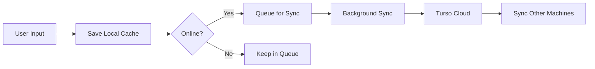

# Phase 2 - Sincronização Multi-Máquina

## 🎯 Objetivos
- Sincronizar histórico entre múltiplas máquinas
- Funcionar offline com cache local
- Resolver conflitos automaticamente
- Manter performance mesmo com grandes volumes

## 🏗️ Arquitetura Proposta

### 1. Cache Local (SQLite)
```
~/.mcp-terminal/cache.db
├── history_cache (mirror do Turso)
├── sync_queue (comandos pendentes de sync)
└── sync_metadata (último sync, versões)
```

### 2. Fluxo de Sincronização



### 3. Resolução de Conflitos
- **Estratégia**: Last-Write-Wins baseado em timestamp
- **UUID único** por comando para evitar duplicatas
- **Merge** de históricos de diferentes máquinas

## 📋 Componentes a Implementar

### 1. LocalCache Manager (`libs/local-cache.ts`)
- SQLite para armazenamento local
- Espelhamento das tabelas do Turso
- Queue de sincronização para modo offline

### 2. SyncManager (`libs/sync-manager.ts`)
- Sincronização bidirecional
- Detecção de conflitos
- Merge de históricos
- Retry com backoff exponencial

### 3. ConflictResolver (`libs/conflict-resolver.js`)
- Algoritmo Last-Write-Wins
- Detecção de duplicatas por UUID
- Merge de comandos de múltiplas máquinas

### 4. BackgroundSync (`libs/background-sync.js`)
- Worker thread para sync periódico
- Não bloqueia UI principal
- Configurable interval (default: 30s)

## 🔄 Estados de Sincronização

1. **SYNCHRONIZED**: Cache local = Turso
2. **PENDING_UPLOAD**: Novos comandos locais para enviar
3. **PENDING_DOWNLOAD**: Novos comandos remotos para baixar
4. **CONFLICT**: Necessita resolução
5. **OFFLINE**: Sem conexão, usando cache

## 📊 Tabelas do Cache Local

### history_cache
```sql
CREATE TABLE history_cache (
    id TEXT PRIMARY KEY,
    command TEXT NOT NULL,
    response TEXT,
    timestamp INTEGER NOT NULL,
    user_id TEXT,
    machine_id TEXT,
    session_id TEXT,
    status TEXT,
    tokens_used INTEGER,
    sync_status TEXT DEFAULT 'pending',
    last_synced INTEGER,
    command_uuid TEXT UNIQUE
);
```

### sync_queue
```sql
CREATE TABLE sync_queue (
    id INTEGER PRIMARY KEY AUTOINCREMENT,
    operation TEXT NOT NULL, -- 'insert', 'update', 'delete'
    table_name TEXT NOT NULL,
    record_id TEXT NOT NULL,
    data TEXT NOT NULL, -- JSON
    created_at INTEGER NOT NULL,
    retry_count INTEGER DEFAULT 0,
    last_error TEXT
);
```

### sync_metadata
```sql
CREATE TABLE sync_metadata (
    key TEXT PRIMARY KEY,
    value TEXT,
    updated_at INTEGER
);
```

## 🚀 Fases de Implementação

### Fase 2.1 - Cache Local Básico
- [ ] Implementar LocalCache com SQLite
- [ ] Mirror básico do Turso
- [ ] Salvar comandos localmente primeiro

### Fase 2.2 - Sync Unidirecional
- [ ] Upload: Local → Turso
- [ ] Queue de comandos pendentes
- [ ] Retry em caso de falha

### Fase 2.3 - Sync Bidirecional
- [ ] Download: Turso → Local
- [ ] Merge de históricos
- [ ] Resolução de conflitos

### Fase 2.4 - Background Sync
- [ ] Worker thread para sync
- [ ] Sync periódico configurável
- [ ] Indicadores de status na UI

## 🎯 Benefícios Esperados

1. **Performance**: Leitura instantânea do cache local
2. **Resiliência**: Funciona offline
3. **Consistência**: Eventual consistency entre máquinas
4. **UX**: Sem bloqueio de UI durante sync

## 🔧 Configuração

```json
{
  "sync": {
    "enabled": true,
    "interval": 30000, // 30 segundos
    "batch_size": 100,
    "retry_attempts": 3,
    "offline_mode": "auto"
  }
}
```
